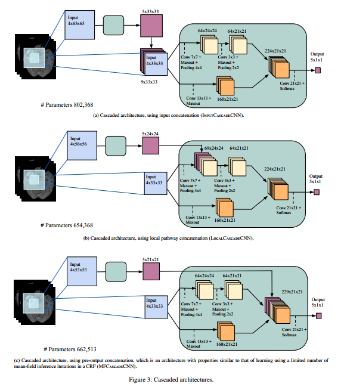

# Brain-Tumor-Segmentation-Keras
Keras implementation of the multi-channel cascaded architecture introduced in the [paper](https://arxiv.org/pdf/1505.03540.pdf) "Brain Tumor Segmentation with Deep Neural Networks" by Mohammad Havaei, Axel Davy, David Warde-Farley, Antoine Biard, Aaron Courville, Yoshua Bengio, Chris Pal, Pierre-Marc Jodoin, Hugo Larochelle. 

## Architecture



- Two pathways (channels) instead of the usual single feedforward. One is the **local channel**, looking at the local context of the pixel and the other is the **global channel**, looking at the global context of the image.

- In the usual feedforward architecture, the *values* of the nearby pixels affect a pixel's prediction. But it makes sense that the *prediction* of nearby pixels should also influence a pixel's prediction. So, the paper proposes a cascaded architecture, where there are multiple choices (**input**, **local** and **final**) for the cascade to be applied (see figure above), leading to three possible architectures.

- Fully connected layers replaced by 1x1 Convolutions to speed up computation.

- **2-phase training**: The dataset is highly unbalanced. So, the authors propose 2-phase training, where in the 1st phase, the entire model is trained using a balanced dataset and in the 2nd phase, only the classification layer is fine-tuned according to the actual data distribution.

## Building the model

```python
# Required for Layers which have different functions for 
# training / testing (e.g. Dropout, BatchNormalization)
Kc.set_learning_phase(True)
multiCascadeCNN = MultichannelCascadeCNN(mode='final')
model = multiCascadeCNN.build_model()
print(model.summary())
```

## Dependencies
- TensorFlow
- Keras

Install them using [pip](https://pypi.python.org/pypi/pip).

## Contributing
It would be great if someone is willing to implement the actual paper results. Feel free to create a Pull Request. If you are a beginner, you can refer [this](https://opensource.guide/how-to-contribute/) for getting started.

## Support
If you found this useful, please consider starring(★) the repo so that it can reach a broader audience.

